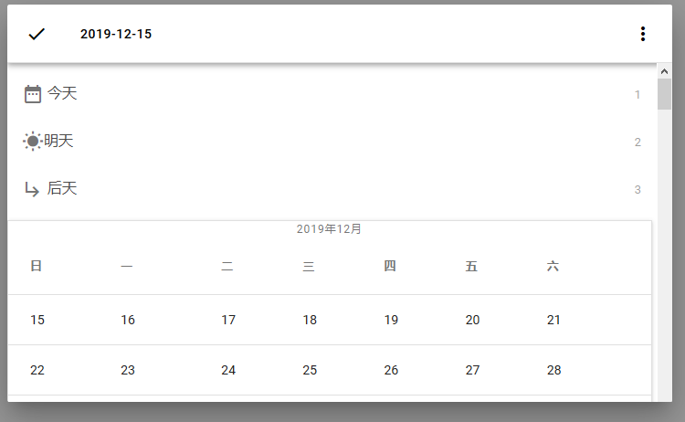
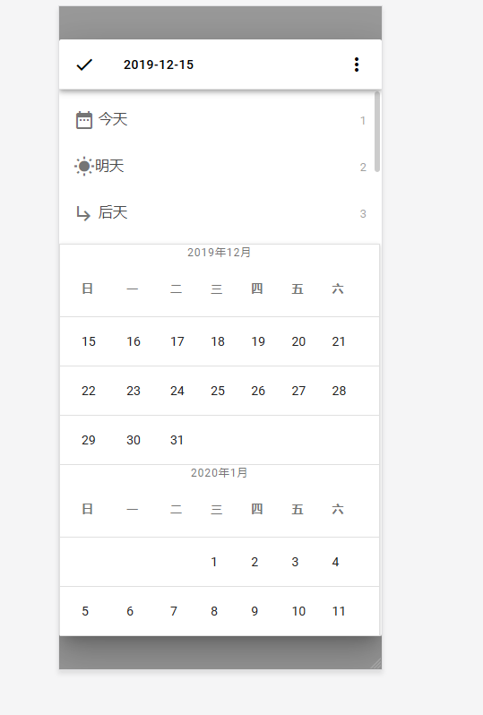

# [DateSelector](https://marksteinsong.github.io/DateSelector/)

基于MDUI的一个简易日期选择器。

##### 顾名思义

这只是一个简易“日期”选择器，所以没有关于“时间”的功能（如果你想要，可以帮我添加！）。


## 截图






## 如何使用？

1.将项目内的DataSelector文件夹拖入你的项目

2.在项目中引用


```javascript
const {DateSelector}=require('./DateSelector');
window.addEventListener("load",function () {
    const ds=new DateSelector();
    ds.open();
    ds.getSelectedDate(function (date) {
       ds.close();
       alert(date);
    });
});
```

## 文档

DateSelector类暴露了三个方法

#### 1.  open()

打开日期选择器对话框

#### 2.close()

关闭日期选择器对话框

#### 3 getSelectedDate(f)

点击√后获取的日期，参数是回调函数。


## License

[MIT](LICENSE.md)